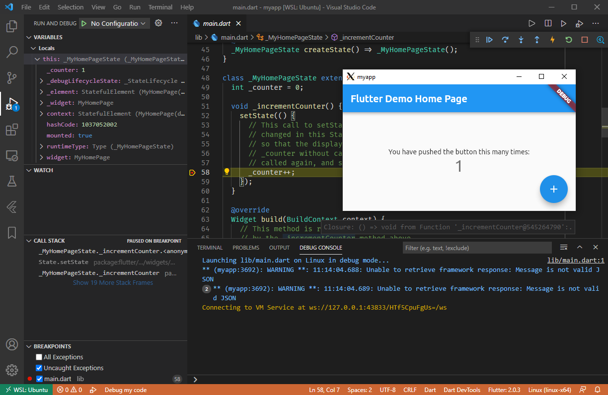

# Flutter 2 desktop development from Windows

Flutter 2 announced [official desktop support](https://medium.com/flutter/whats-new-in-flutter-2-0-fe8e95ecc65). This repo shows how to run windows and Linux Desktop apps from Windows 10.

## Running Ubuntu apps from Windows using WSL2

Here are the main steps that I have followed. They will be detailed in the next sections:

1. Install WSL with a Ubuntu distribution
2. Install Flutter on both Windows and WSL
3. Enable desktop support for Flutter on Both Windows and WSL
4. Create, develop the app on Windows
5. Test and build the Windows desktop app on Windows and switch to WSL to test and build the Linux version

## Install WSL

- Install WSL2 by [following these steps](https://docs.microsoft.com/fr-fr/windows/wsl/install-win10). Choose Ubuntu as the Linux distribution (others should work but I tested on this one).
- Install GUI support by following the instructions [in this tutorial](https://medium.com/@japheth.yates/the-complete-wsl2-gui-setup-2582828f4577).
- Test your setup by opening a GUI app: `mate-calc &`


## Flutter setup on Windows and WSL

Flutter 2 can be easily installed on Windows [following the official instructions](https://flutter.dev/docs/get-started/install). You can also follow the Linux the Linux documentation to install Flutter on WSL or you the remainder of this section for WSL specific instructions.

```sh
# install prerequisites
sudo apt update && sudo apt install git unzip xz-utils zip libglu1-mesa ninja-build libgtk-3-dev build-essential clang cmake ninja-build pkg-config -y
# download the SDK into the current folder
wget https://storage.googleapis.com/flutter_infra/releases/stable/linux/flutter_linux_2.0.3-stable.tar.xz
# unzip the SDK
tar xf ~/Downloads/flutter_linux_2.0.3-stable.tar.xz
# Add the flutter/bin to the PATH environment variable. Here is a way that should do it:
cd flutter/bin
echo 'export PATH="$PATH":'`pwd` >> ~/.zlogin # zsh
echo 'export PATH="$PATH":'`pwd` >> ~/.login # bash
# run initial flutter scripts
flutter precache
flutter doctor
```

The flutter doctor output should at least show a success for *Linux toolchain - develop for Linux desktop*.


## Add desktop support

Once Flutter is installed on both ou OSes, we need to enable desktop support.

- Enable desktop support for all desktop platforms (Windows, Linux and macOS) on windows
  - `flutter config --enable-linux-desktop --enable-macos-desktop --enable-windows-desktop`
- Do the same thing on WSL
  - `flutter config --enable-linux-desktop --enable-macos-desktop --enable-windows-desktop`

## Create and develop the app on Windows

From now on, you can create and develop your Flutter apps as usual. The following steps show how to create a basic app and run it on windows.

```sh
flutter create myapp
cd my app
```

The project should contain all supported OSes 


Next, run the app as a windows desktop app `flutter run -d windows`


## Run and test the Linux app using WSL

Running the app from a WSL prompt is as easy as running `flutter run -d linux`.


Debugging the linux app can be achieved using [the Remote WSL extension of VSCode](https://marketplace.visualstudio.com/items?itemName=ms-vscode-remote.remote-wsl).



## Troubleshooting

### Add the verbose flag to get more insight

If `flutter run` commands fail, add the `--verbose` flag to get more insight on the error: 

For example, I encountered the following error details at one moment thanks to the `--verbose` flag.

```log
[  +92 ms] Building Linux application...
[  +28 ms] <- compile package:myapp/main.dart
[   +3 ms] executing: [build/linux/debug/] cmake -G Ninja -DCMAKE_BUILD_TYPE=Debug /mnt/d/dev/flutter/flutter2_desktop/linux
[ +203 ms] -- Checking for module 'gtk+-3.0'
[        ] --   No package 'gtk+-3.0' found
[   +1 ms] CMake Error at /usr/share/cmake-3.16/Modules/FindPkgConfig.cmake:463 (message):
[   +4 ms]   A required package was not found
[        ] Call Stack (most recent call first):
[        ]   /usr/share/cmake-3.16/Modules/FindPkgConfig.cmake:643 (_pkg_check_modules_internal)
[        ]   flutter/CMakeLists.txt:24 (pkg_check_modules)
```

```log
[ +126 ms] -- Checking for module 'liblzma'
[   +3 ms] --   No package 'liblzma' found
[   +1 ms] CMake Error at /usr/share/cmake-3.16/Modules/FindPkgConfig.cmake:463 (message):
[   +1 ms]   A required package was not found
[        ] Call Stack (most recent call first):
[        ]   /usr/share/cmake-3.16/Modules/FindPkgConfig.cmake:643 (_pkg_check_modules_internal)
[        ]   flutter/CMakeLists.txt:28 (pkg_check_modules)
[  +12 ms] -- Configuring incomplete, errors occurred!
```

### Fix error: file INSTALL cannot copy file

If you encounter this error:

```log
[   +8 ms] CMake Error at cmake_install.cmake:61 (file):
[   +2 ms]   file INSTALL cannot copy file
```

You can try to [fix it by running](https://github.com/flutter/flutter/issues/59890#issuecomment-646885377) `flutter clean`

## Links

- https://flutter.dev/desktop
- https://flutter.dev/docs/get-started/install/linux
- https://www.ivaylopavlov.com/setting-up-windows-terminal-wsl-and-oh-my-zsh